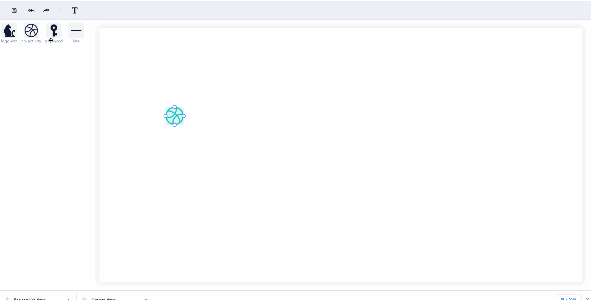
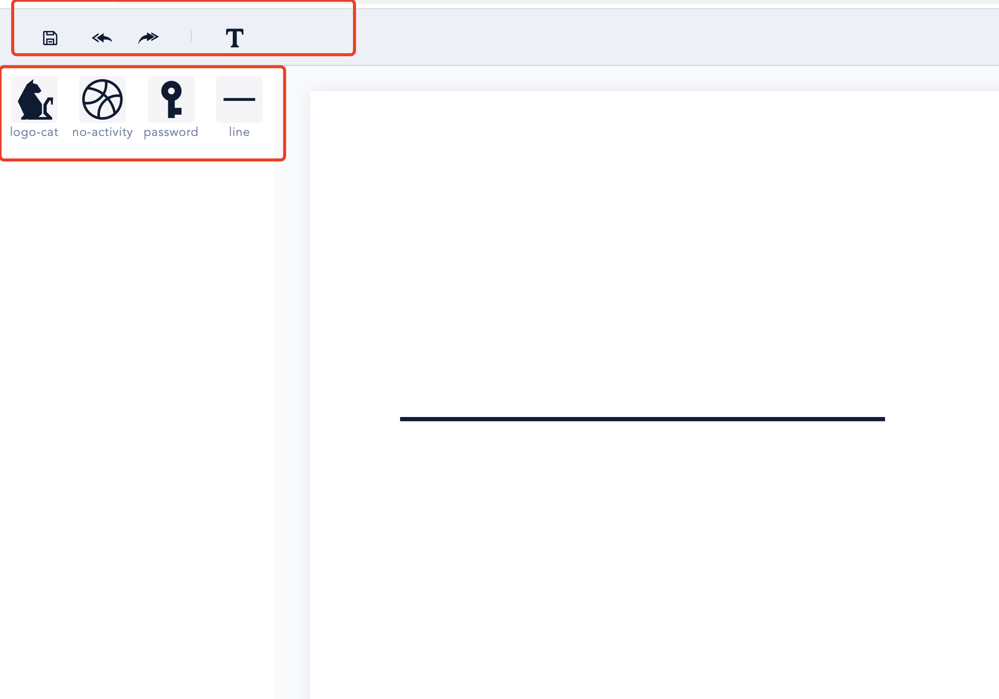
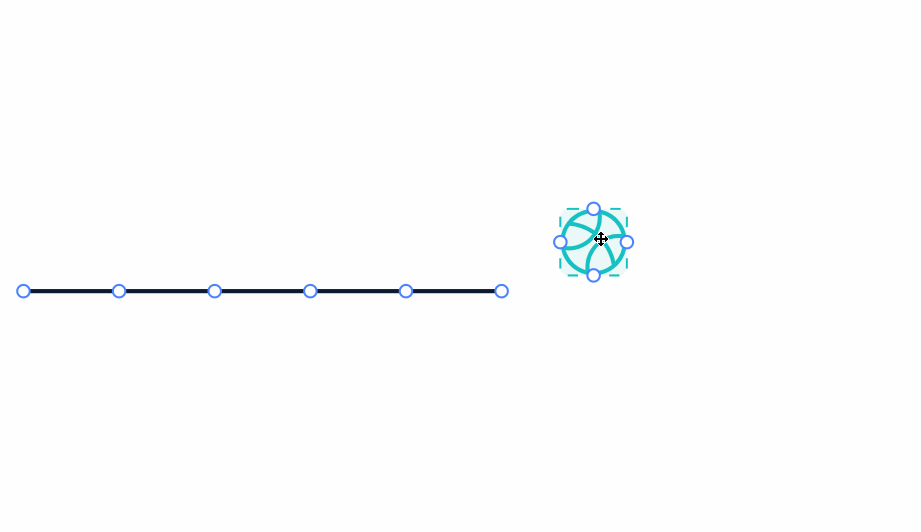
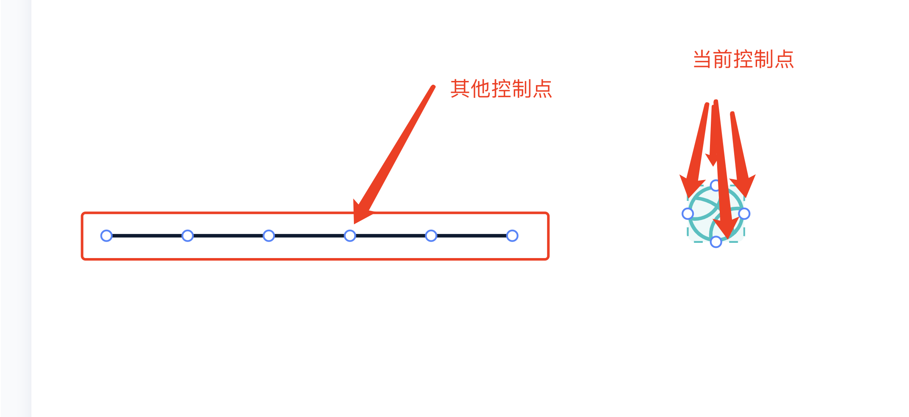
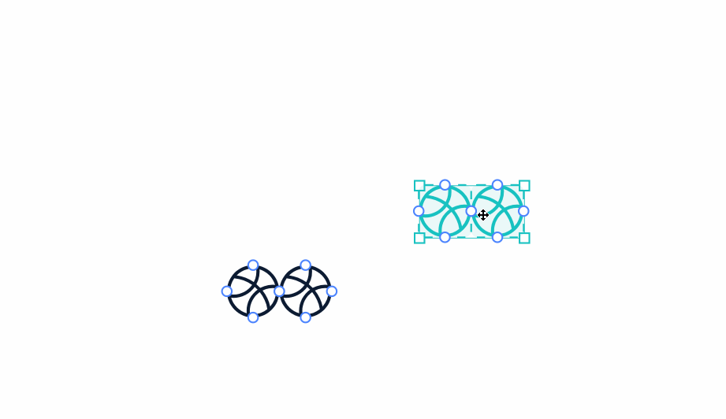
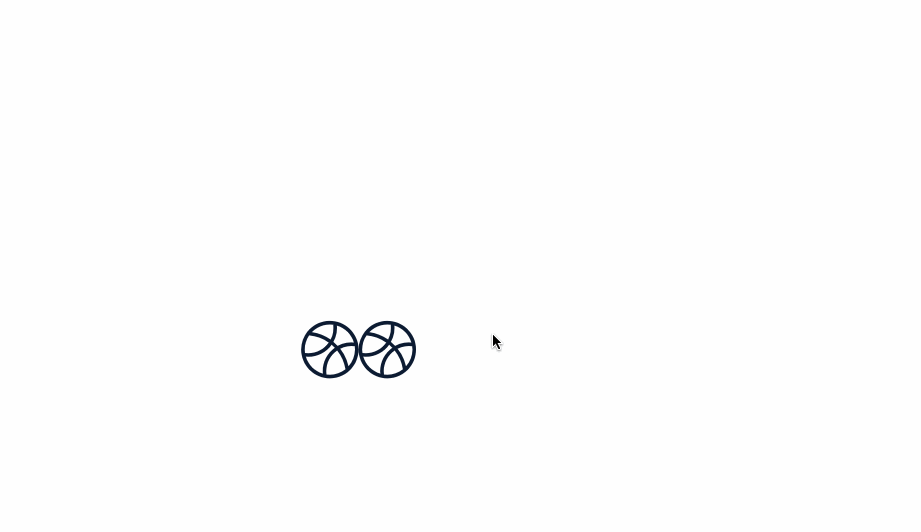
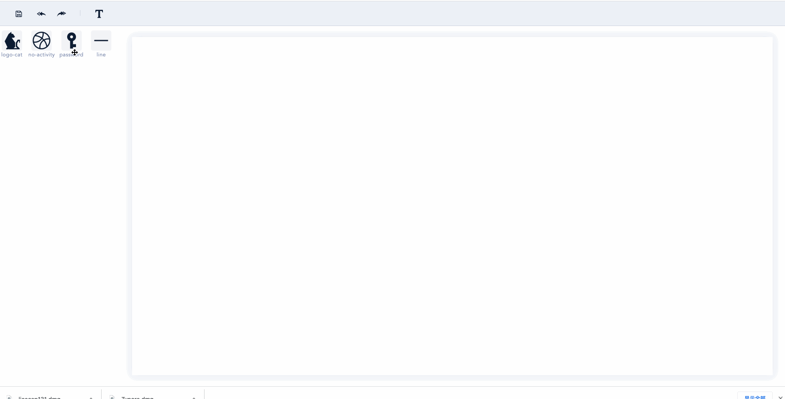
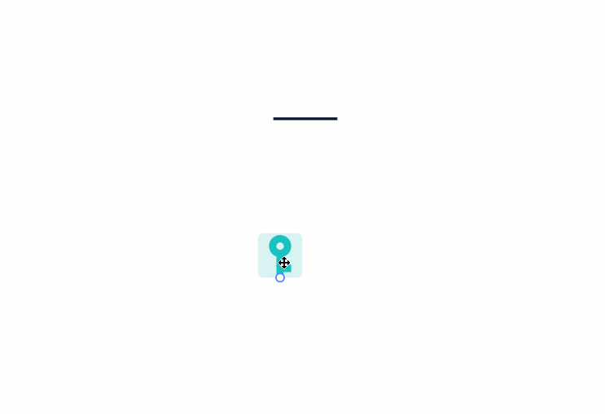
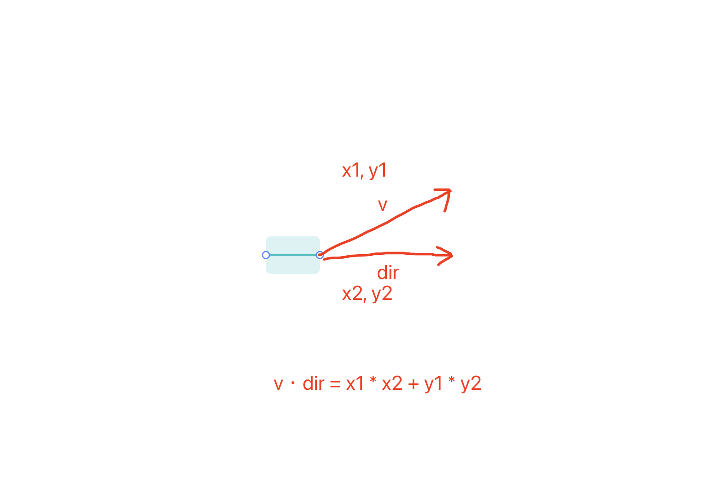

# 图形编辑器开发的一些总结
在上一份工作中有做过电力接线图编辑器开发的工作，电力接线图编辑器的目的是使专业人员能够通过可视化编辑器进行拖拽组合等操作将一个个基础的电路元件(开关、导线、电感器、变压器等等)组合成电路设配的电路接线图，并能够为每一个电路元件绑定测点（如电流、电压的测点可以拿到对应的电流、电压的数据），将电力数据实时的反应到接线图中，已到达可视化监控的目的。

Demo



## 技术选型
调研了市面上比较火的两款canvas绘图库fabric.js和konva.js 通过对比发现 fabric.js 并没有提供比较好的方式进行自定义图形绘制
而konva.js则可以自定义sceneFunc函数的方式自定义绘制如下官网的例子
```js
var rect = new Konva.Shape({
  x: 10,
  y: 20,
  fill: '#00D2FF',
  width: 100,
  height: 50,
  sceneFunc: function (context, shape) {
    context.beginPath();
    // 不用设置rect的位置，框架会自动处理
    context.rect(0, 0, shape.getAttr('width'), shape.getAttr('height'));
    // Konva 扩展的一个非常重要的方法
    // 绘制设置的样式
    context.fillStrokeShape(shape);
  }
});
```
由于项目是接线图编辑器，每一个基础元件都不是简单的几何图形需要自定义绘制，因此选择konva.js作为绘图库

## 模块的拆分
编辑器的开发是一个比较复杂的过程，需要进行各个模块的拆分，每个模块遵循单一责任原则，降低开发复杂度。
```
1. UI                                        # 视图层 （与编辑器核心无关，如顶部的工具栏、左侧的菜单栏展示的电路元件图标等）
2. BaseComponent                             # 图形元件基类 （封装通用的属性和方法）  
   SvgComponent                              # 通过svg path 路径绘制的图形元件的类型 继承 BaseComponent
   LineBaseComponnet                         # 导线元件类型 (有拉伸的功能) 继承 BaseComponent
3. Editor                                    # 编辑器核心，下面所有的模块都要在这里初始化       
    # 交互模块 每个模块都是函数或者是class
    3.1  adsorbentInteraction                # 图形吸附    通过控制点吸附
    3.2  snappingInteraction                 # 图形吸附    通过吸附线吸附
    3.3  zoomInteraction                     # 画布缩放
    3.3  historyInteraction                  # 历史记录 （收集通用的操作产生的历史数据，处理Undo, Redo逻辑）
    3.4  HistoreStore                        # 历史记录仓库 （存放历史操作数据，在发生Undo/Redo动作时触发historeChange事件）
    3.5  selectionInteraction                # 选区管理  （处理用户单选，多选，拖拽交互及对应操作发生是展示的样式）
    3.6  SelectionStore                      # 选区管理仓库  （存放当前选择的元素）
    3.7  dropInteraction                     # 拖放交互  (鼠标选择左侧菜单图形元件并拖放到画布创建对应的图形到画布中，内部监听drop事件)
    3.8  lineStretchingInteraction           # 导线拉伸  （导线组件可进行拉伸变长）
    3.9  textInteraction                     # 文本编辑  （画布中的文本编辑）
    3.10 contextMenuInteraction              # 右键菜单   （提供选择图形可操作的菜单项：复制，旋转，删除，镜像，绑定数据。。。）
    3.11 Command                             # 命令管理  （提供图形操作的命令：如复制，旋转，删除，镜像，绑定数据，每种命令都会产生操作历史，Command会自动将操作增量数据添加的historeStore中）
    3.12 cursorInteraction                   # 鼠标手型样式控制
    3.13 CursorManager                       # 鼠标手型管理
```

## UI 视图层
ui 视图层是和编辑器核心逻辑相互独立的，编辑器所有功能均由Editor实现


## 元件类型
### BaseComponent
封装通用的熟悉和方法，具体的绘制方法由子类实现
```js
class BaseComponent extends konva.Group {
  constructor () {
    this.xxx = xxx
    // 通用的熟悉
    ...
  }
  // 通用的方法
  ...
  // 抽象方法 由子类实现具体的图形绘制
  createShapes () {
    return []
  }
  // 抽象方法 由子类实现具体的控制点的绘制
  createControlPoints () {
    return []
  }
}
```

## Editor 编辑器类
所有的交互模块均由这里初始化

```js
// 缩放
import { registerZoomInteraction, zoomToPoint } from '../interaction/zoomInteraction.js'
class Editor extends EventEmitter {
  constructor (config = {}) {
    super()
    if (!config.stage) throw new Error('stage config must be provided')
    this.layout = {
      padding: [30, 30],
      width: config.stage.width || 0,
      height: config.stage.height || 0
    }
    this.config = config
    this.stage = new konva.Stage(config.stage)
    this.layer = new konva.Layer()
    this.layer.add(this.textTransformer)
    this.stage.add(this.layer)
    // 顶层layer 处理临时图形提升性能
    this.upperLayer = new konva.Layer()
    this.stage.add(this.upperLayer)
    // 历史记录
    this.historyStore = new HistoryStore()
    // 选中
    this.selectionStore = new SelectionStore()
    // 命令
    this.command = new Command({
      editor: this
    })
    // 鼠标手型管理
    this.cursorManager = new CursorManager({ el: this.stage.getContainer() })
    // 选框
    this.selectionBox = new SelectionBox({
      visible: false
    })
    this.upperLayer.add(this.selectionBox)
    this.interactions = []
    this.initEditor(config.initJSON)
  }
  // 初始化编辑器
  initEditor () {
    this.initInteraction()
  }
  // 交互逻辑都在这里初始化
  initInteraction () {
    // 缩放
    this.interactions.push(registerZoomInteraction({
      stage: this.stage,
      zoomBy: 1.05
    }))
    // 更多的交互都将在这里register
    ...
  }
  // 销毁，释放资源
  destroy () {
    this.historyStore.destroy()
    this.historyStore = null
    this.interactions.forEach(unInteraction => {
      if (unInteraction) {
        unInteraction.destroy()
      }
    })
    this.stage.destroy()
  }
  // 更多代码
  ...
}
```

对于各个interaction模块来说  Editor 充当一个总管家，每个interaction模块都可以共享Editor中实例化的对象 如 `this.command` `this.historeStore` `this.selectionStore`

## adsorbentInteraction 通过控制点吸附组件
收集需要参与碰撞检查的控制点， 检测当前拖拽图形的控制点与其他控制的的距离是否小于控制点的直径，小于则可以吸附，更新控制点的颜色，在拖拽结束时若可以吸附则调整当前图形的位置



## snappingInteraction 通过吸附线吸附

收集可吸附位置
1. 画布的上 中 下 左 中 右
1. 图形的上 中 下 左 中 右
判断图形的 上 中 下 左 中 右 位置是否和其他图形的可吸附位置距离达到阈值(10px)
已达到阈值则调整位置

# zoomInteraction 画布缩放

默认缩放是基于原点（0, 0）缩放的
若要已鼠标位置为缩放中心则需要转换
```js
/**
 * 指定缩放中心缩放舞台
*/
export function zoomToPoint (stage, point, oldZoom, zoom) {
  const position = stage.position()
  stage.scale({
    x: zoom,
    y: zoom
  })
  const scaled = zoom / oldZoom
  const offsetX = (point.x - position.x) * (scaled - 1)
  const offsetY = (point.y - position.y) * (scaled - 1)
  stage.position({
    x: position.x - offsetX,
    y: position.y - offsetY
  })
}
zoomToPoint(stage, { x: 30, y: 100 }, 1, 2)
```


## historyInteraction 历史管理模块

收集历史操作数据，处理Undo,Redo画布更新
```js
// 收集历史操作数据
historyStore.push(createHistoryData({
  historyType: HISTORY_TYPES.create,
    target: target,
    agrs: nodes
}))
// 历史变化更新画布
historyStore.on('historychange', (forward, historyData) => {
  switch (historyData.historyType) {
    case HISTORY_TYPES.create:
      handleCreateHistory(forward, historyData)
      break
    case HISTORY_TYPES.remove:
    case HISTORY_TYPES.destroy:
      handleRemoveOrDestroyHistory(forward, historyData)
      break
    case HISTORY_TYPES.drag:
      handleDragHistory(forward, historyData)
      break
    case HISTORY_TYPES.transformChange:
      handleTransformHistory(forward, historyData)
      break
    case HISTORY_TYPES.layerChange:
      handleLayerChangeHistory(forward, historyData)
      break
    case HISTORY_TYPES.attrsChange:
      handleAttrsChangeHistory(forward, historyData)
      break
    default: {
      // 使用扩展的历史类型及对应的处理函数
      const handle = HISTORY_HANDLES[historyData.historyType]
      if (handle) {
        handle(forward, historyData)
      }
    }
  }
})
```

## HistoreStore 历史记录仓库
管理存放历史，Undo,Redo发生是触发historyChange事件
```js
class HistoryStore extends EventEmitter {
  constructor (config = {}) {
    super()
    this.config = config
    // 能够保存的最大历史记录长度
    this.maxHistoryLength = config.maxHistoryLength || 100
    // 历史记录数组
    this._history = []
    // 当前的历史进程
    this._currStep = -1
    // 标识是否可以添加到历史，如撤销和前进时不能更改历史记录，只有对元素操作时才会产生历史
    this._canPushHistory = true
    this._isDestroyed = false
  }
  // 更多方法
  ...
  // 添加历史
  push (...historyDatas) {}
  // 操作历史后退前进
  go (n) {
    ...
    this.fire('historychange', false, this._history[this._currStep], this._currStep)
  }
  // 清空历史
  clear () {
    this._history = []
    this._currStep = -1
  }
  ...
  // 更多方法
}
```

## selectionInteraction 选区管理

处理用户单选，多选，拖拽交互及对应操作发生是展示的样式

## SelectionStore 选区管理仓库 
存放当前选择的元素
```js
class SelectionStore extends EventEmitter {
  constructor () {
    super()
    this._activeElement = []
    this._selectionChangeEventName = 'selectionChange'
  }
  // 获取选择元素
  getActiveElement () {
    return this._activeElement || []
  }
  // 选区变化
  selectionChange () {
    this.fire(this._selectionChangeEventName, this._activeElement)
  }
  // 选中元素
  setActiveElement (el) {
    this._activeElement.forEach(el => {
      el.setAttr('_selected', false)
    })
    if (!el) {
      this._activeElement = []
      this.selectionChange()
      return
    }
    if ('length' in el) {
      this._activeElement = el
    } else {
      this._activeElement = [el]
    }
    this.selectionChange()
    this._activeElement.forEach(el => {
      el.setAttr('_selected', true)
    })
  }
}
```

## dropInteraction 拖放交互
鼠标选择左侧菜单图形元件并拖放到画布创建对应的图形到画布中，内部监听drop事件
```js
// 从dataTransfer中获取数据
function getJSONFromDataTransfer (e) {
  let jsonStr = e.dataTransfer.getData('text')
  if (!jsonStr) return null
  try {
    jsonStr = JSON.parse(jsonStr)
  } catch (e) {
    jsonStr = null
  }
  return jsonStr
}
export function registerDropInteraction ({ stage, layer, command }) {
  const container = stage.getContainer()
  const dropFunc = e => {
    const json = getJSONFromDataTransfer(e)
    if (json) {
      stage.setPointersPositions(e)
      let component
      const Constructor = wiringDiagramComponents[json.name]
      component = new Constructor({
        draggable: true
      })
      if (component) {
        component.position(transformPointByPointer(stage, stage.getPointerPosition()))
        command.selectElement(component)
        layer.add(component)
      } else {
        console.warn('no component created')
      }
    }
  }
  const dragOverFunc = e => {
    e.preventDefault()
  }
  container.addEventListener('drop', dropFunc)
  container.addEventListener('dragover', dragOverFunc)
  return {
    destroy () {
      container.removeEventListener('drop', dropFunc)
      container.removeEventListener('dragover', dragOverFunc)
    }
  }
}

// ui 层 通过监听touchstart事件 设置dataTransfer的值
e.dataTransfer.setData(
  "text",
  JSON.stringify({
    name: componentName,
    type: ComponentNames.BaseComponent,
  })
);
```

## lineStretchingInteraction 导线拉伸
计算用户拉伸产生的横向位移 根据横向位置改变导线的长度


## textInteraction 文本编辑
监听dbclick 事件 动态创建textarea文本域将其绝对定位到正确的位置

## contextMenuInteraction 右键菜单
监听contextmenu事件并阻止默认事件，生成menu

## Command 操作命令
用于实现各种命令功能如复制，删除，旋转...等
```js
class Command extends EventEmitter {
  // 执行命令
  exec (action, ...args) {
    const handleAction = this[action]
    // 从selectionStore中获取选中的元素
    const targets = this.selectionStore.getActiveElement()
    handleAction.call(this, ...args)
  }
  copy () {}
  delete () {}
  rotate () {}
}

// 使用
const command = new Command()
command.exec('copy', args)
```
## cursorInteraction 鼠标手型管理 控制鼠标手型样式
监听图形的mouseenter mouseleave等事件 调用cursorManager的setCursor方法改变手型
## CursorManager 手型控制
```js
const GRAB_CURSOR = 'grab'
const DEFAULT_CURSOR = 'auto'
class CursorManager {
  constructor ({ el } = {}) {
    this._cursor = DEFAULT_CURSOR
    this._el = el
    this._isLock = false
  }
  lock () {
    this._isLock = true
  }
  unLock () {
    this._isLock = false
  }
  grab () {
    this.setCursor(GRAB_CURSOR)
  }
  reset () {
    this.setCursor(DEFAULT_CURSOR)
  }
  setCursor (cursor) {
    if (this._isLock) return
    if (this._cursor !== cursor) {
      this._cursor = cursor
      this._el.style.cursor = cursor
    }
  }
}
```
